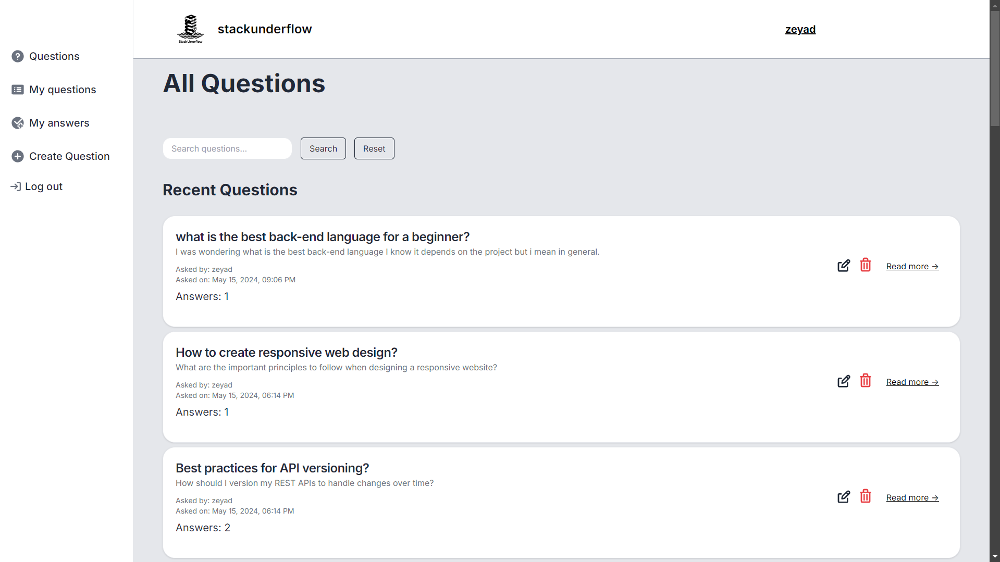

---

# StackUnderflow

**StackUnderflow** is a Q&A platform designed to allow users to ask questions, provide answers, and engage with the community. Built with PHP, Tailwind CSS, and JavaScript, StackUnderflow offers a clean and modern design inspired by StackOverflow, making it a great solution for communities to share knowledge and solve problems.

## Features

- **User Authentication**: Users can register, log in, and manage their profiles.
- **Ask Questions**: Users can post questions and describe their issues.
- **Answer Questions**: Users can provide answers to questions.
- **Ratings**: Users can rate answers both questions and answers.
- **Search Functionality**: Users can search through existing questions and answers.
- **Tailwind CSS**: A responsive and modern design that adapts to various screen sizes.
- **JavaScript Interactivity**: Dynamic elements for an enhanced user experience.

## Technologies Used

- **PHP**: Backend server-side logic for handling requests, user authentication, and database interactions.
- **Tailwind CSS**: A utility-first CSS framework for building responsive and modern designs quickly.
- **JavaScript**: Enhances user interactivity and responsiveness.

## Getting Started

To get a local copy of the project running, follow these steps:

### Prerequisites

- PHP 7.4 or higher
- A local web server (like XAMPP, WAMP, or LAMP)
- A MySQL

## Collaborators

- **[Mohammed Almahmud](https://github.com/mohdAlmahmud)**
- **[Musallam Aldossari](https://github.com/swe-musalem)**
- **[Zeyad Aldosari](https://github.com/zeyadAldosari)**

## Screenshots

